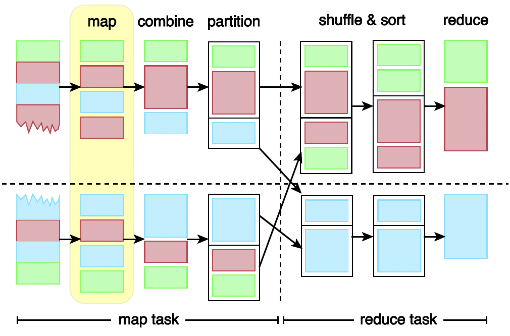
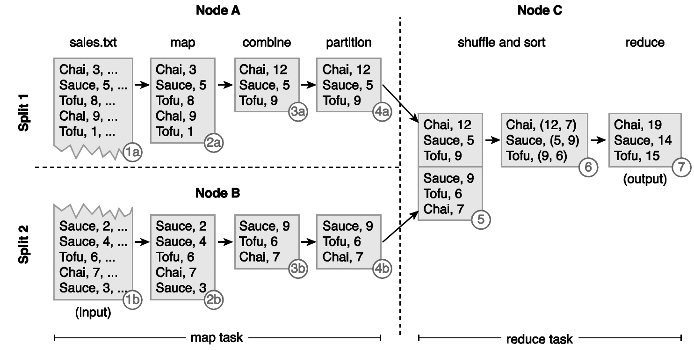

介绍MapReduce的原理、工作流程、数据流和系统架构。

<!-- more -->

# MapReduce

## 1. MapReduce介绍

### 概览

 MapReduce是一个用来对数据进行批处理的框架，**可扩展性**和**可靠性**高，能够提供**容忍差错**。在MapReduce框架下，输入数据并不需要按照一定数据模型，因此该框架能处理无模式的数据。MapReduce框架将数据分为若干数据块，能够并行处理和运算，从每个数据块得到的运算结果经过汇总得到最终结果。

传统的数据处理需要将数据迁移至处理数据的结点上，然而MapReduce则是将**数据处理程序迁移至储存数据的结点**上，这样避免了大批量数据的移动，同时也能够**节省带宽**、**减少处理大数据的时间**。

### 工作流程

一个MapReduce作业(Job)是一系列需要完成的工作，Hadoop将一项作业分为两个任务(Task)**map**和**reduce**，然后把MapReduce作业所需要的输入数据分为多个分片(Split)，并且为每一个分片创建一个map任务，对这一块中的每一条记录执行map函数。

**Map**阶段: 数据分为多个更小的分片(Split)，每个分片由**键值对**组成。用户定义的Map函数(mapper)对每个分片执行，由每一个原键值对，生成**一个或者多个新的键值对**。

$$(K_1, V_1) \rightarrow \text{list}(K_2, V_2)$$

**Combine**阶段: 对于大规模数据，在Map和Reduce两阶段之间交换有很高开销。Combiner在Map阶段完成后，对数据**预先进行规约**，然后再交给Reduce阶段。比如我们想要计算每个键对应值之和，即可在combine阶段把每个键值和算出来，再传入后续的Reduce阶段，以此减少Map和Reduce之间数据交换的开销。

$$(K_2, \text{list}(V_2)) \rightarrow \text{list}(K_2, V_2)$$

**Partition**阶段: 如果MapReduce作业涉及多个reducer，需要使用Partition函数(partitioner)，按照一定规则将mapper或combiner的输出结果分块。分块完成后，所有具有**相同键**的键值对均**位于同一分块中**。分块可以是range-based的，比如将a-m开头的键划分成分块一，将n-z开头的键划分成分块二，这样分块一给第一个reducer，分块二给第二个reducer。

**Shuffle-Sort**阶段: 由partitioner产生的结果通过网络传输至执行reduce任务的结点，在每个结点中，键值对**根据键进行排序和**分组。

$$\text{list}(K_2, V_2) \rightarrow (K_2, \text{list}(V_2))$$

**Reduce**阶段: Reduce函数(reducer)对每个键的值进行规约，汇总得到最终结果。整个作业的输出结果由若干文件组成，每个文件由一个reducer得到。

$$(K_2, \text{list}(V_2)) \rightarrow \text{list}(K_3, V_3)$$

## 2. MapReduce数据流
