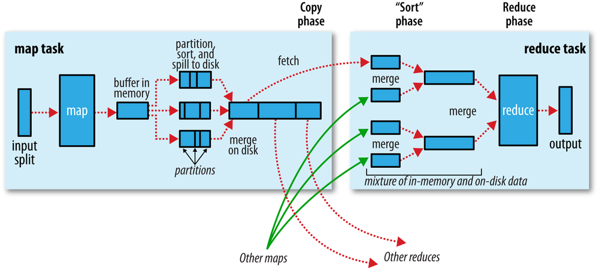
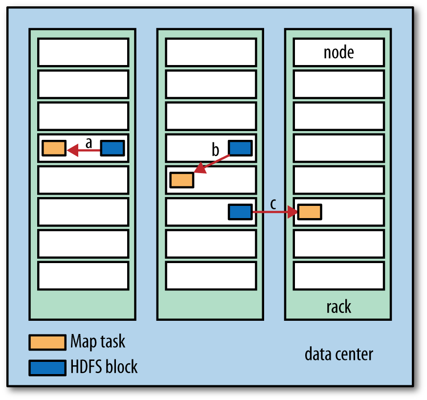
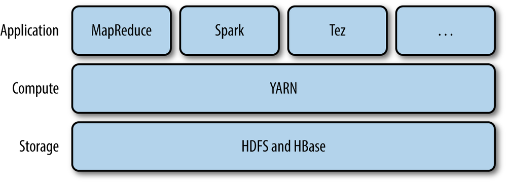
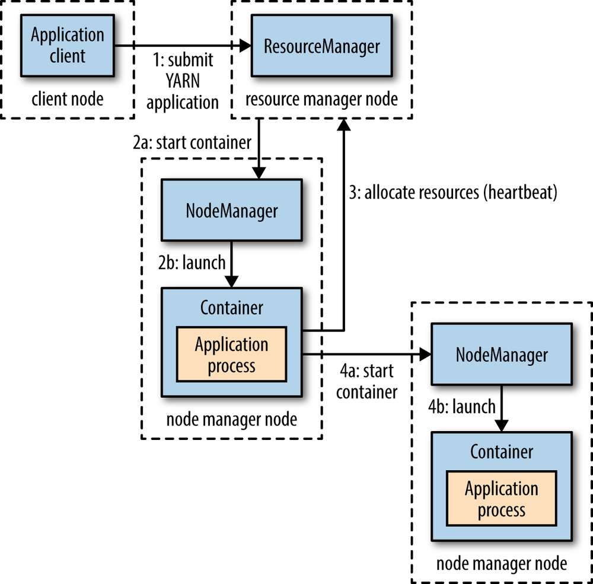
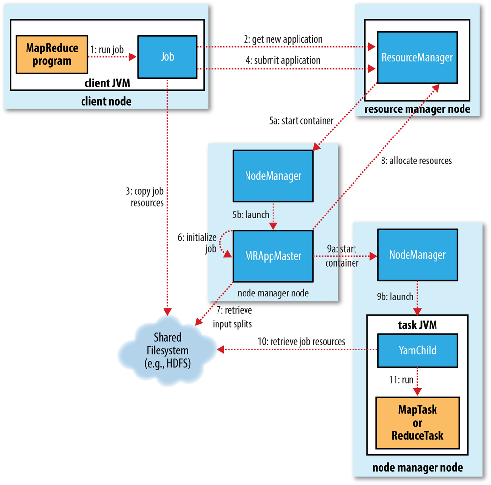

# MapReduce

## 1. MapReduce介绍

### 概览

 MapReduce是用来对数据进行批处理的计算框架，**可扩展性**和**可靠性**高，能够提供**容忍差错**。在MapReduce框架下，输入数据并不需要按照一定数据模型，因此该框架能处理无模式的数据。MapReduce框架将数据分为若干数据块，能够并行处理和运算，从每个数据块得到的运算结果经过汇总得到最终结果。

传统的数据处理需要将数据迁移至处理数据的结点上，然而MapReduce则是将**数据处理程序迁移至储存数据的结点**上，这样避免了大批量数据的移动，同时也能够**节省带宽**、**减少处理大数据的时间**。

### 工作流程

MapReduce作业(Job)由一系列需要完成的工作组成，Hadoop将一项作业分为两个任务(Task)**map**和**reduce**，然后把MapReduce作业所需要的输入数据分为若干分片(Split)，为每一个分片创建一个map任务，对其中每一条记录执行map函数。

**Map**阶段: 数据分为多个更小的分片(Split)，每个分片由**键值对**组成。用户定义的Map函数(mapper)对每个分片执行，由每一个原键值对，生成**一个或者多个新的键值对**。

$$(K_1, V_1) \rightarrow \text{list}(K_2, V_2)$$

**Combine**阶段: 对于大规模数据，在Map和Reduce两阶段之间交换有很高开销，而Combine阶段事实上就是对这一部分开销的**优化**。Combiner在Map阶段完成后，对数据**预先进行规约**，然后再交给Reduce阶段。比如我们想要计算每个键对应值之和，即可在combine阶段把每个键值和算出来，再传入后续的Reduce阶段，以此减少Map和Reduce之间数据交换的开销。

$$(K_2, \text{list}(V_2)) \rightarrow \text{list}(K_2, V_2)$$

**Partition**阶段: 如果MapReduce作业涉及多个reducer，需要使用Partition函数(partitioner)，按照一定规则将mapper或combiner的输出结果分块。分块完成后，所有具有**相同键**的键值对均**位于同一分块中**。分块可以是range-based的，比如将a-m开头的键划分成分块一，将n-z开头的键划分成分块二，这样分块一给第一个reducer，分块二给第二个reducer。

**Shuffle-Sort**阶段: 由partitioner产生的结果通过网络传输至执行reduce任务的结点，在每个结点中，键值对**根据键进行排序和**分组。MapReduce确保每个reducer的输入都按照键排序。在Map端，每个任务都有默认大小为100Mb的环形缓冲区，任务输出至该环形缓冲区，一旦缓冲内容达到阈值，就将内容溢出写至磁盘。在Reduce端，当一个Map任务执行完成，reduce任务就开始复制map的输出结果至磁盘或者内存(小数据)，复制完成后将map的结果合并排序。

$$\text{list}(K_2, V_2) \rightarrow (K_2, \text{list}(V_2))$$

**Reduce**阶段: Reduce函数(reducer)对每个键的值进行规约，汇总得到最终结果。整个作业的输出结果由若干文件组成，每个文件由一个reducer得到。

$$(K_2, \text{list}(V_2)) \rightarrow \text{list}(K_3, V_3)$$

## 2. MapReduce数据流

### Map任务选址

Map任务执行前，将优先选择HDFS中**存储输入数据的结点**，在该结点上运行Map任务，节省集群中结点之间相互传输的带宽，这一特点称为**数据本地化**。如果该结点不可用，调度程序会选择一个与该结点处于**同一机架**(rack)，且不执行Map任务的空闲结点。如果该机架中无可用结点，才从其他机架中选取结点，该操作需要机架之间的网络传输。

对于Reduce任务，每个**reducer的输入**需要从**所有mapper的输出**得到(比如要从mapper输出结果中获取某个分块)，因此结点之间的网络传输不可避免，从而没有数据本地化的特性。

### 数据分片大小

Map任务对输入数据的多个分片并行执行，因此当每个分片数据比较小时，数据处理的负载平衡性会更好。但如果分片太小，每个**分片的管理和Map任务的创建开销**将占总时间消耗的主导部分。通常每个分片与一个**HDFS块**的大小一致，默认设置为**128Mb**。

### Mapper输出

Map任务将输出写入至**本地磁盘**，而不是HDFS，因为数据存储至HDFS会**占用集群的资源**。Map的输出是中间结果，交给Reduec任务来得到最终结果，一旦作业完成，该Map输出即可丢弃。当执行Map任务的结点发生故障后，中间结果就会丢失，需要选择另一个结点**重新执行**Map任务。

## 3. MapReduce工作机制

### YARN机制

YARN是Hadoop集群资源管理系统，MapReduce等分布式计算框架作为应用层，运行在集群计算层(YARN)和存储层(HDFS)上。

YARN提供两类长期运行的**守护进程**：资源管理器和结点管理器。**资源管理器**在集群中只有一个，用于**管理集群内部的资源**使用。**结点管理器**位于每个结点上，能够**启动和监控容器**，从而为应用进程的执行提供特定的运行环境和资源。

YARN按照如下步骤**运行应用**：
- 1.客户端向资源管理器请求运行一个应用主进程(application master process)
- 2.资源管理器寻找一个结点管理器，其结点能够创建特定容器、启动应用主进程
- 3.应用主进程向资源管理器请求更多容器
- 4.请求得到多个容器后，应用主进程执行分布式运算

YARN有三种调度方式，分别是FIFO调度、容量调度和公平调度。FIFO调度按照应用的提交顺序执行和分配资源；容量调度另外提供一个队列，保证小作业一提交就可以启动；公平调度能够在所有运行的作业之间动态地平衡资源。

### 作业运行

MapReduce作业的运行涉及如下五个实体：
- 客户端：向YARN资源管理器提交MapReduce作业
- YARN资源管理器：协调集群上的计算资源分配
- YARN结点管理器：启动和监控集群中机器上用于计算的容器
- MapReduce应用主进程：协调运行MapReduce作业中的任务，主进程和任务在容器中运行，容器由**资源管理器分配**，由**结点管理器管理**
- 分布式文件系统HDFS：在实体之间共享作业所需文件

MapReduce的作业和作业中的任务都有一个**状态**，状态包括如下信息：作业或任务的**状态**(运行中、成功完成、失败等)、Map和Reduce任务的**进度**、作业**计数器**的值、状态**消息**或描述。

### 故障处理

- 任务失败：应用主进程对任务**重新调度**，选择另一个可用的结点管理器。如果失败太多次，将不再重试，整个作业失败。
    > 可能由mapper、reducer、JVM的bug或者任务时间超时引起。

- 应用主进程失败：应用主进程会向资源管理器周期性发送**心跳信息**(heartbeat)，在其失败时资源管理器能够检测到，并且由结点管理器在新的容器中启动一个新的实例。如果一个应用主进程失败了太多次，将不再重启，整个作业失败。
    > 对于应用主进程，其状态可根据**作业历史**恢复，因此**不需要重新启动**。

- 结点管理器失败：该情况下，资源管理器会告知停止发送**心跳信息**的结点管理器，接着将其从可用(可启动容器)**结点池中移除**。
    > 在该故障的结点上，已完成的map任务需要重新启动，因为map阶段输出存储至该结点本地，由于失败无法访问。已完成的reduce任务无需重新执行，因为输出已储存至HDFS。

- 资源管理器失败：该故障是最严重的，默认配置下资源管理器是**单点故障**，因为一旦故障，所有运行的作业都将失败且无法恢复。为获得**高可用性**，可自定义配置**运行一对资源管理器**，另一个作为备用(standby)。
    > **运行中的应用**信息可**储存在一个状态储存区**中，一般借助HDFS进行备份，备用机可根据该信息恢复资源管理器的状态。结点管理器的信息**不需要**储存，因为结点能够由资源管理器快速重启。任务的信息同样**不需要**存储，任务由应用主进程管理，不属于资源管理器状态。

### 推测执行

MapReduce作业的运行时间与执行缓慢的“拖后腿”任务相关，对于这种问题，Hadoop会在任务执行时检测其是否比预期慢，并且**启动另一个相同的任务作为备份**，这样的执行方式称为**推测执行**。调度器在执行过程中会检测同类型任务的进度，当一小部分任务的执行速度远低于平均时，将启动这一部分任务的推测副本，而当一个任务完成时，其所有副本将终止运行。